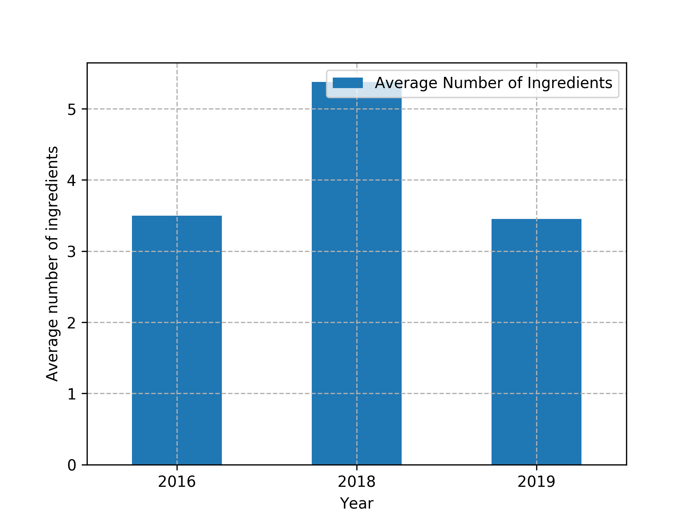
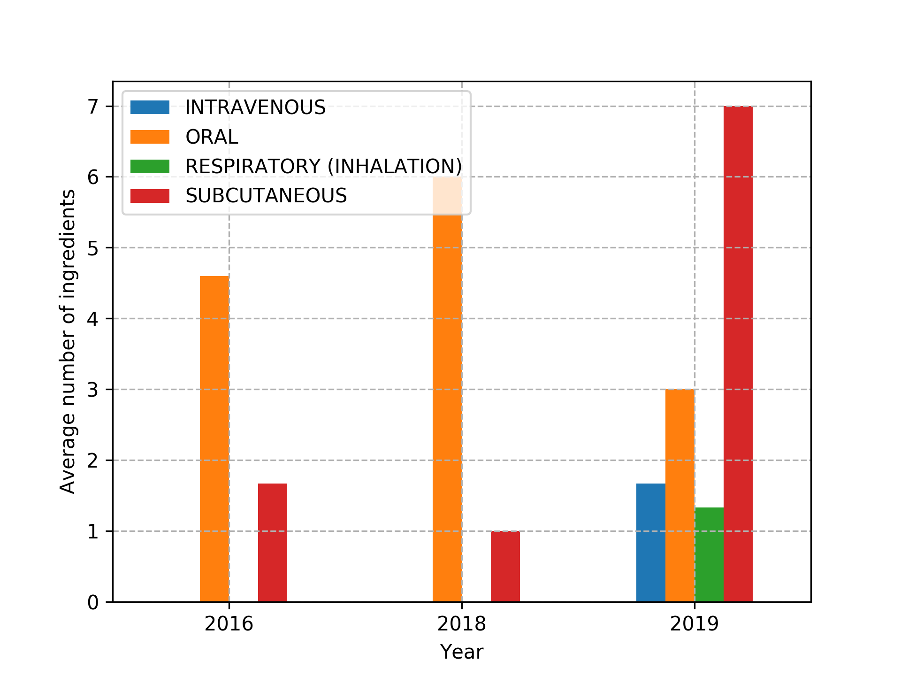
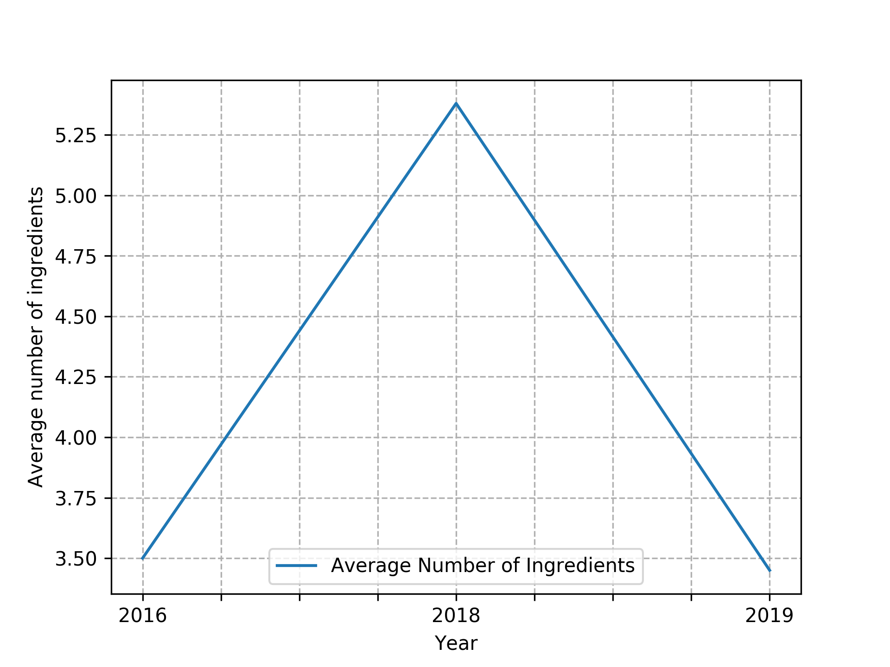
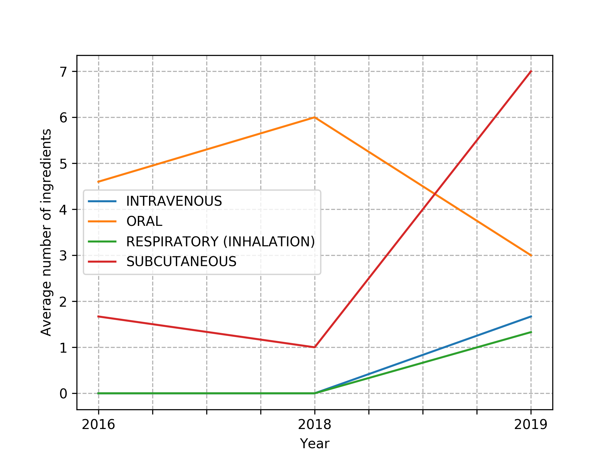

# AZ Coding Execise

This repository contains code to query the OpenFDA API and retrieve drug information 
for a particular manufacturer, transform and visualise the data.

**Notes:**
 - The search for AstraZeneca products under the `openfda.manufacturer_name` field yields
    only 27 records.
 - Consequently, the average number of ingredients for per year and per year per route are
    significantly less than the exercise suggests.
 - Ingredients listed in the `spl_product_data_elements` field are assumed to be separated
    by the `,` delimiter. 
 - Tested for python >= 3.6

**Table of Contents:**
1. [Install](#install)
2. [Run](#run)
3. [Help](#help)
4. [Results](#results)

## Install

```
# clone repo
pip install -r requirements.txt
```

## Run

Use `python main.py` to run the preset configuration found in `config.ini`.

To run a custom experiment use `python main.py <params>`. For example:

```
python main.py -p "bar" -s True -a "route"  -m "AstraZeneca"
```

The argument `-a "generic"` runs Part A of the exercise and `-a "route"` runs Part B.

## Help
```
usage: main.py [-h] [-u BASE_URL] [-m MANUFACTURER] [-p {line,bar}]
               [-s SAVE_FIG] [-a {generic,route}]

AstraZeneca Coding Exercise

optional arguments:
  -h, --help            show this help message and exit

API specific options:
  -u, --base-url BASE_URL
                        Base url for API query (default: https://api.fda.gov/d
                        rug/label.json?search=openfda.manufacturer_name:)
  -m, --manufacturer MANUFACTURER
                        Drug manufacturer (default: AstraZeneca)

Plot specific options:
  -p, --plot-type {line,bar}
                        Type of plot to produce (default: bar)
  -s, --save-fig SAVE_FIG
                        Whether to save the figure (default: True)

Anaylsis options:
  -a, --analysis-type {generic,route}
                        The type of analysis to undertake (default: generic)

```
## Results
### Bar Plots

Call: `python main.py -p "bar" -s True -a "generic" -m "AstraZeneca"`

```
Retrieving 0-27 of 27 records
****************RESULTS***********************
   year                                         drug_names  average_number_of_ingredients
0  2016  [CANDESARTAN CILEXETIL AND HYDROCHLOROTHIAZIDE...                           3.50
1  2018  [EXENATIDE, OLAPARIB, OSIMERTINIB, SODIUM ZIRC...                           5.38
2  2019  [EXENATIDE, DAPAGLIFLOZIN AND SAXAGLIPTIN, EXE...                           3.45
```

<p align="center">
  
</p>

Call: `python main.py -p "bar" -s True -a "route" -m "AstraZeneca"`

```
Retrieving 0-27 of 27 records
****************RESULTS***********************
   year                     route  average_number_of_ingredients
0  2016                      ORAL                           4.60
1  2016              SUBCUTANEOUS                           1.67
2  2018                      ORAL                           6.00
3  2018              SUBCUTANEOUS                           1.00
4  2019               INTRAVENOUS                           1.67
5  2019                      ORAL                           3.00
6  2019  RESPIRATORY (INHALATION)                           1.33
7  2019              SUBCUTANEOUS                           7.00

```

<p align="center">
  
</p>

### Line Plots

Call: `python main.py -p "line" -s True -a "generic" -m "AstraZeneca"` produces
the same text output as above but the following line plot:

<p align="center">
  
</p>

Call: `python main.py -p "line" -s True -a "route" -m "AstraZeneca"` produces
the same text output as above but the following line plot:

<p align="center">
  
</p>

    

